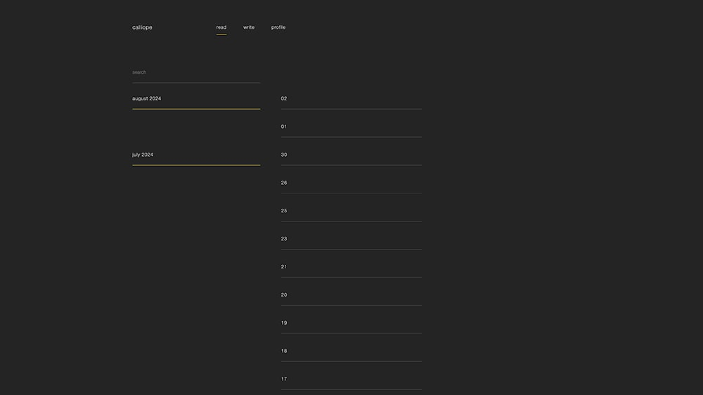
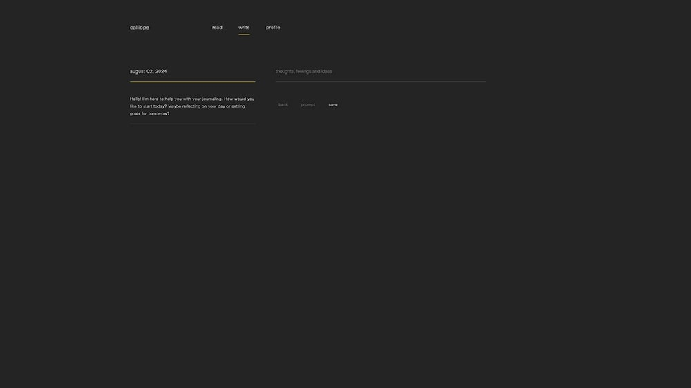

# Calliope
## Description

Calliope is a personal journalling platform built using Django, HTMX and Open AI.
It features:

- Create, update view and delete daily journal entries.
- Search functionality.
- Request AI prompts based on what you have written already.
- User authentication.
- Change email with confirmation.

This project is currently in development as a side project.

## Table of Contents

- [Calliope](#calliope)
  - [Description](#description)
  - [Table of Contents](#table-of-contents)
  - [Local Installation](#local-installation)
  - [Screenshots](#screenshots)

## Local Installation

1. Ensure you have docker installed [Docker](https://www.docker.com/)
2. Add .env to root directory containing the following environment variables:
    - SECRET_KEY=**< django secret key >**
    - OPENAI_KEY=**< OpenAI API key >**
    - DJANGO_DEBUG=**< True >**
    - ADMIN_URL=**< your chosen admin url slug >**
3. `$ docker-compose up --build`
4. `$ docker-compose exec web python manage.py migrate`
5. `$ docker-compose exec web python manage.py runserver`
6. Navigate to local host [localhost](http://127.0.0.1:8000/) in your browser

## Screenshots

Homepage

Journal Entry Page

