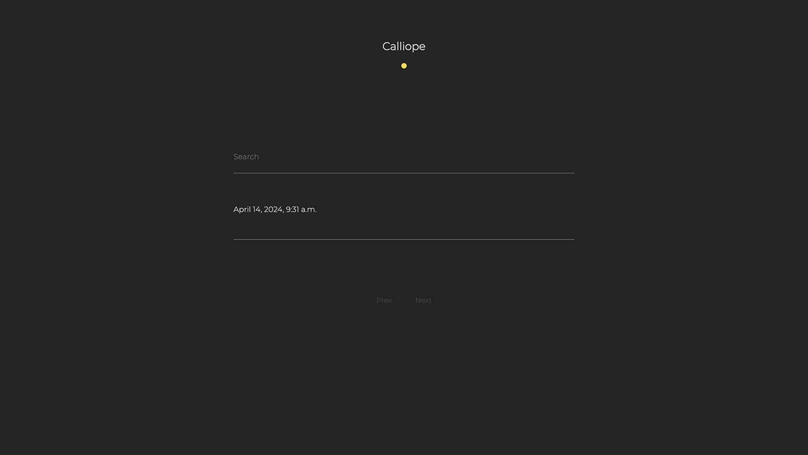
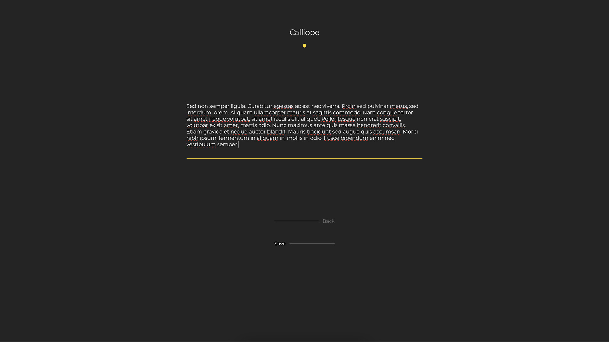

# Calliope
### Description

Calliope is a personal AI powered journalling platform built using Django, HTMX, OpenAI and the Bootstrap5 grid. The platform uses AI to talk users through completing a daily personal journal. The intent of this project is to experiment with Django and HTMX to create a modern application without a utilising a front end framework, and also to dispel some of the Django 'magic' and develop a deeper understanding of the framework. This project has also allowed me to experiment with OpenAI's API functionality.

This project is currently in development as a side project.

## Table of Contents

- [Calliope](#calliope)
    - [Description](#description)
  - [Table of Contents](#table-of-contents)
  - [Installation](#installation)
  - [Screenshots](#screenshots)
  - [License](#license)

## Installation

1. Ensure you have docker installed [Docker](https://www.docker.com/)
2. Add .env to root directory containing the following environment variables:
    - SECRET_KEY=**< django secret key >**
    - OPENAI_KEY=**< OpenAI API key >**
    - DJANGO_DEBUG=**< True >**
    - ADMIN_URL=**< your chosen admin url slug >**
3. `$ docker-compose up --build`
4. `$ docker-compose exec web python manage.py migrate`
5. `$ docker-compose exec web python manage.py runserver`
6. Navigate to local host [localhost](http://127.0.0.1:8000/) in your browser

## Screenshots

Homepage

Journal Entry Page

## License

AGPL-3.0 license